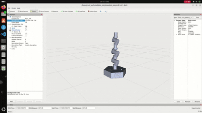

# Introduction
This project contains an example of simulating robot arm in RViz2 with a keyboard in ROS2.



## How to
1. The project has two folder. `edo_sim` contains the urdf file of the e.Do robot arm. it was downloaded from this [repo](https://github.com/Comau/eDO_description) and converted for ROS2.
2. `arm_controller` consists of a node that publishes **joint states** and triggers based on keyboard press. (`w`, `s`, `a`, `d`)
3. Clone the repo in your ros2 workspace (`ros2_ws`).
4. Use rosdep to Install Dependencies. \
Run the following command from the root of your ROS 2 workspace (where the src folder is located):
```bash
rosdep install --from-paths src --ignore-src -r -y
```
5. Install `pynput` python package.
```bash
pip3 install pynput
```

6. Build the packages.
```bash
colcon build
```

7. If build succeed, First publish `joint_state` using the `arm_controller`.
```bash
ros2 run arm_controller keyboard_control
```

8. Load the Robot in Rviz.
```bash
ros2 launch edo_sim display.launch.py
```

9. In Rviz, set the Fixed frame to `base_link`. If you don't see any `base_link` make sure to check if `joint_state` is publishing. Add a plugin ``RobotModel` and select Topic in which `robot_description` is being published (Command in step 8 publishes the robot_description).